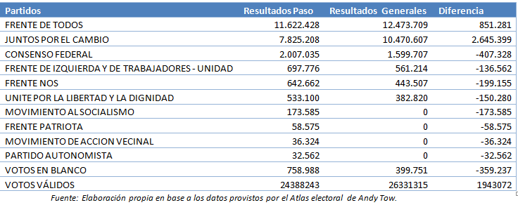

# Electoral-competition-model-Argentinian-Elections

This project aims to determine how was vote transfered from the 2019 PASO (argentinian primaries rlrction) election to the General election that took place two months afterwards. In other words, this model tries to asses how voters that casted their votes in the PASO election, behaved later on in the general election. Therefore, the results portrayed in this project can give insights on the ability of each party to retain/alienate votes from one election to another one. 

## How?

To determine vote transfer a multivariate linear regression model was used in which, the independent variables are the percentages obtained by each party in each voting table across the entire country in the PASO election, whereas the dependent variables are the percentages obtained by each party in the general election in each voting table across the entire country. 
The package used is statsmodel.api runned in python.

## Main results

As it was said in the introduction, this model tries to explain how was vote transfered from the argentinian primary election to the general election. The results obtained in both of them are portrayed in the table showned below.

The results obtained by the model are summarized in the sankey diagram displayed below. The width of the nodes connecting the X-axis with the y-axis are the fraction of the total votes casted to the Party that compited in the PASO election that were transfered to the party that compited latter on in the General election. This is to say, the wider the node, the higher the percentaje of votes that Party A lost in the General election. 

.png)

